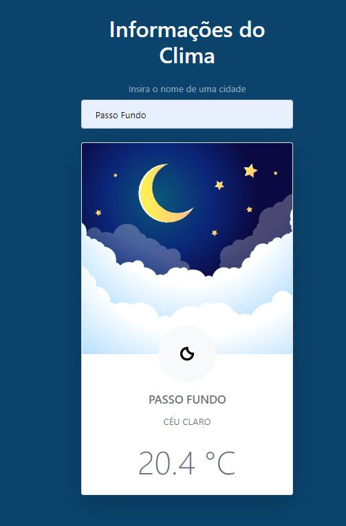

# Nome do projeto

<!---Esses são exemplos. Veja https://shields.io para outras pessoas ou para personalizar este conjunto de escudos. Você pode querer incluir dependências, status do projeto e informações de licença aqui--->




> Aplicativo que verifica o clima atual da cidade pesquisada. Para pesquisar, digite o nome da cidade desejada e clique no botão "Enter" para mostrar os dados do clima. 

## :rocket: Tecnologias utilizadas no projeto

As tecnologias utilizadas no projeto foram:

- [HTML5](https://developer.mozilla.org/en-US/docs/Web/Guide/HTML/HTML5)
- [CSS3](https://developer.mozilla.org/en-US/docs/Web/CSS)
- [JavaScript](https://developer.mozilla.org/en-US/docs/Web/JavaScript)

- Obs: menção para api do [AccuWeather](https://www.accuweather.com/) que foi utlizada para pesquisa do clima

### Ajustes e melhorias

O projeto ainda está em desenvolvimento e as próximas atualizações serão voltadas nas seguintes tarefas:

- [x] Deixar a ultima cidade pesquisada, quando a "cidade" pesquisada não for encontrada
- [x] Criar readme explicando o projeto
- [ ] Hospedar aplicação em um site online
- [ ] Gerar logs das pesquisas feitas
- [ ] Quando o campo perder o foco, fazer a busca automática da "expressão" digitada
- [ ] Guardar no storage do navegador as cidades/termos pesquisados
- [ ] Mostrar botão com mais detalhes (apresentar temperatura, umidade, e turnos madruga, manhã, tarde e noite)

## 💻 Pré-requisitos

Antes de começar, verifique se você atendeu aos seguintes requisitos:
<!---Estes são apenas requisitos de exemplo. Adicionar, duplicar ou remover conforme necessário--->
* Ter instalado algum desses navegadores: `<Firefox / Chrome / Safari>` ou algum outro compativel com `<HTML / ECMAScript 6 ou +>`
* Ter uma máquina `<Windows / Linux / Mac>`.
* Ler a documentação `<README.md>` desse projeto.

## 🚀 Instalando Weather Application

```
Não é necessário instalação para rodar o projeto
```

## ☕ Usando Weather Application

Para usar a Weather Application, siga estas etapas:

```
    # Clonar o repositório
    $ git clone https://github.com/alexvieirasj/weather-application.git

    # Entrar no diretório baixado
    $ cd weather-application
```

É preciso ter instalado no computador o [Git](https://git-scm.com) (para rodar os comandos). O projeto pode ser baixado com as linhas de comando citadas ou no formato zip, clicando no botão `<Code>` na opção `<Download ZIP>`

## 📫 Contribuindo para Weather Application
<!---Se o seu README for longo ou se você tiver algum processo ou etapas específicas que deseja que os contribuidores sigam, considere a criação de um arquivo CONTRIBUTING.md separado--->
Para contribuir com <nome_do_projeto>, siga estas etapas:

1. Bifurque este repositório.
2. Crie um branch: `git checkout -b <nome_branch>`.
3. Faça suas alterações e confirme-as: `git commit -m '<mensagem_commit>'`
4. Envie para o branch original: `git push origin <nome_do_projeto> / <local>`
5. Crie a solicitação de pull.

Como alternativa, consulte a documentação do GitHub em [como criar uma solicitação pull](https://help.github.com/en/github/collaborating-with-issues-and-pull-requests/creating-a-pull-request).

## 🤝 Colaboradores

Agradecemos às seguintes pessoas que contribuíram para este projeto:

<table>
  <tr>
    <td align="center">
      <a href="#">
        <br>
        <sub>
          <b>Alex Vieira</b>
        </sub>
      </a>
    </td>
  </tr>
</table>


## 😄 Seja um dos contribuidores<br>

Quer fazer parte desse projeto? Clique [AQUI](CONTRIBUTING.md) (todo: fazer arquivo de contribuição) e leia como contribuir.

## 📝 Licença

Esse projeto está sob licença. Veja o arquivo [LICENÇA](https://github.com/alexvieirasj/weather-application/blob/main/LICENSE) para mais detalhes.

[⬆ Voltar ao topo](#weather-application)<br>
